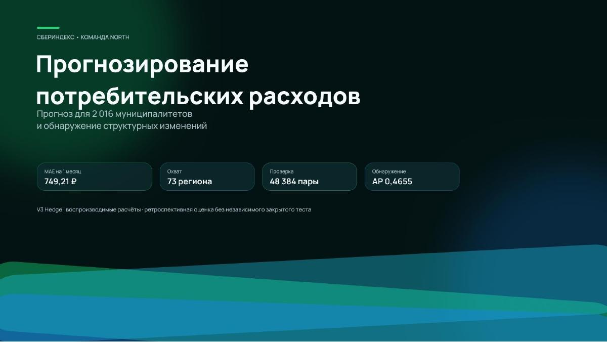
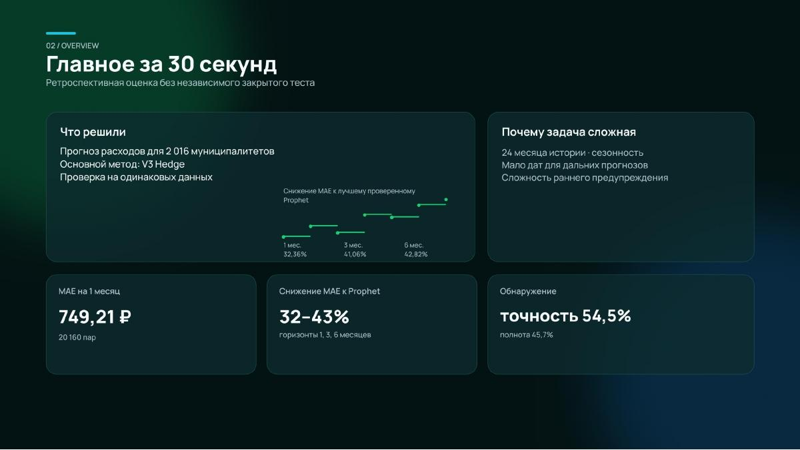
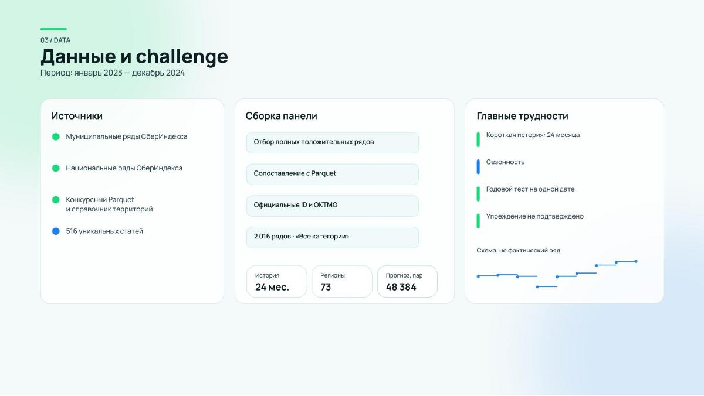
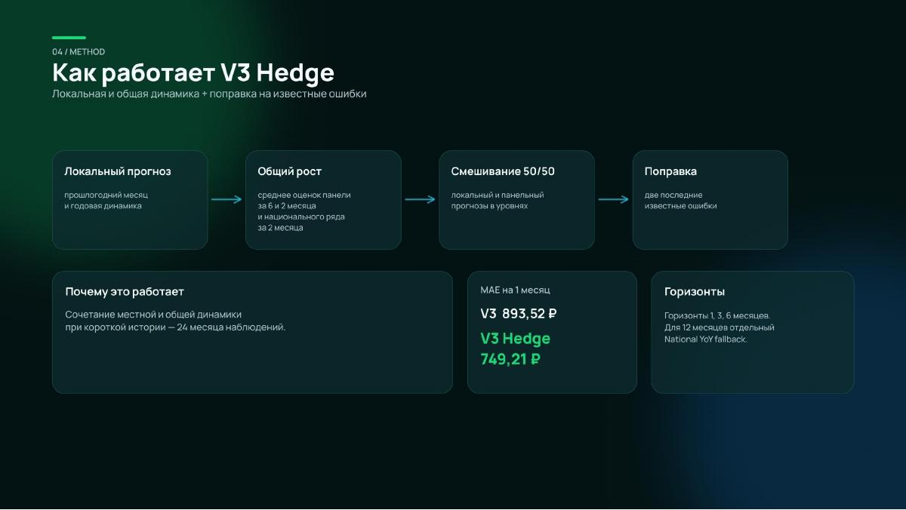
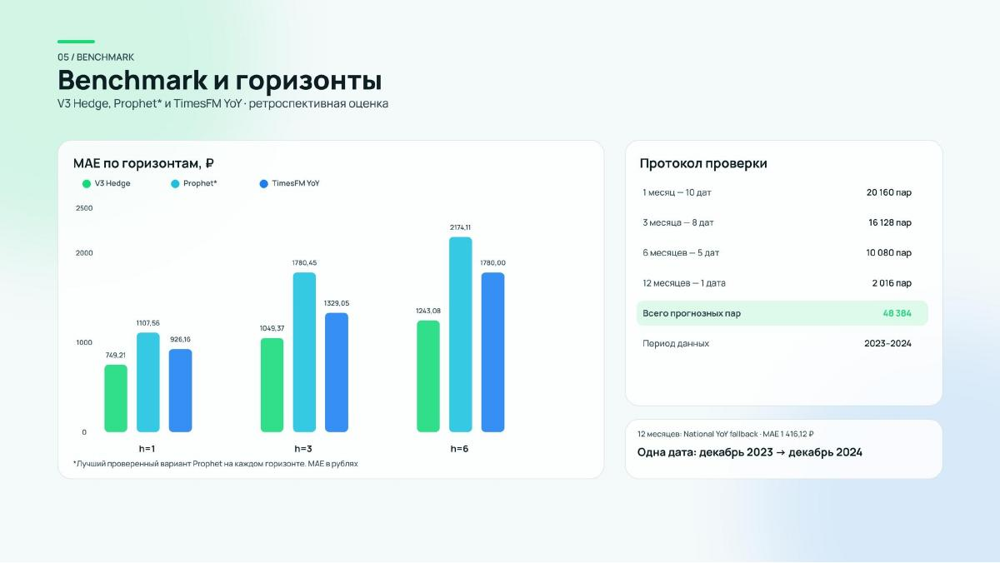
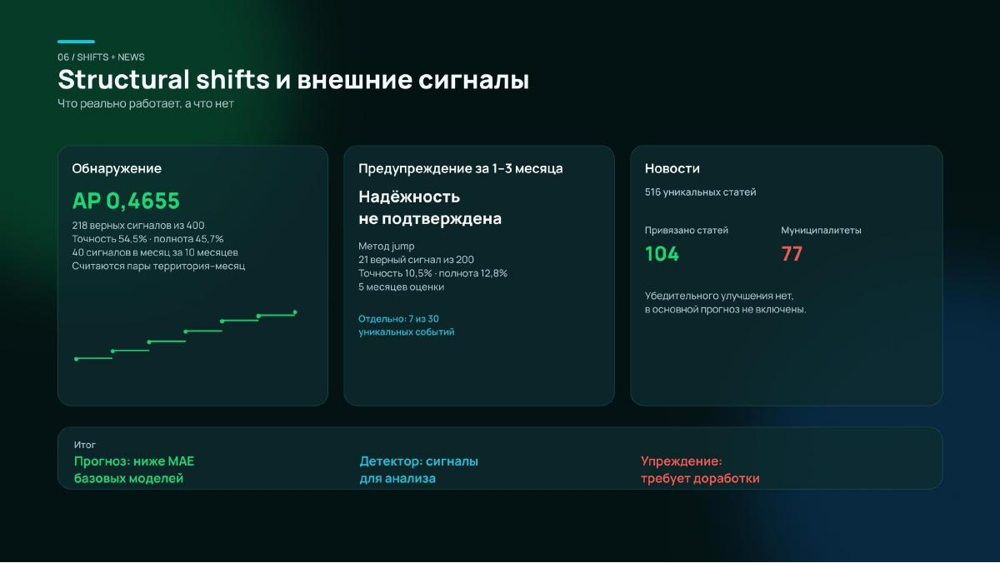
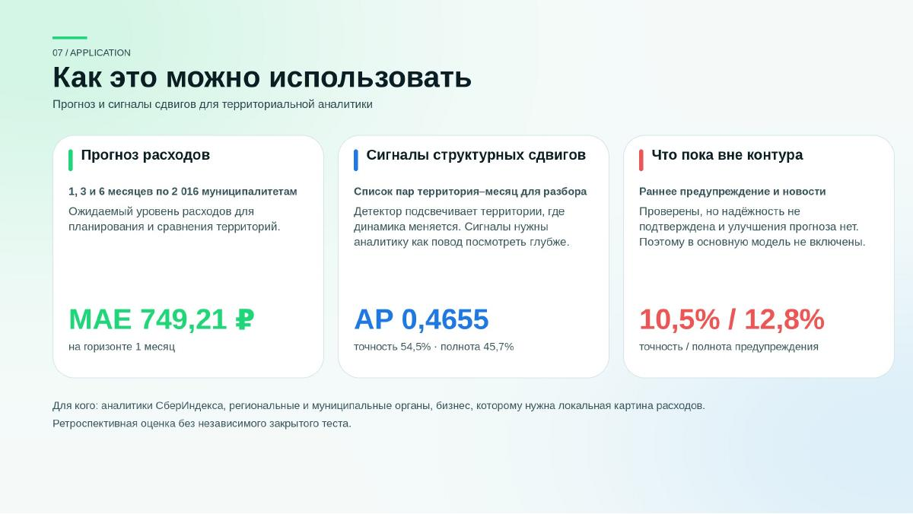
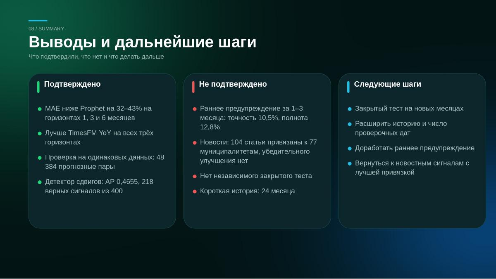

# SberIndex Forecasting
### Прогнозирование потребления и обнаружение локальных изменений

Конкурсный исследовательский проект на данных СберИндекса. **2 016 муниципалитетов · 73 региона · 24 месяца наблюдений.**

[**Презентация ↓**](#презентация) &nbsp; · &nbsp; [**Научный отчёт →**](SUBMISSION_CURRENT.md) &nbsp; · &nbsp; [**Воспроизводимость ↓**](#проверка-расчётов)

## Для жюри конкурса СберИндекс

**Команда NORTH · единая точка входа в материалы конкурсной работы.**

| Материал | Ссылка | Назначение |
|:--|:--|:--|
| Краткое описание и ключевые результаты | [Этот README](README.md) | Обзор решения, основные метрики и ограничения |
| Актуальный исследовательский отчёт | [SUBMISSION_CURRENT.md](SUBMISSION_CURRENT.md) | Методология, проверка во времени, сравнения и результаты на 7 октября 2026 года |
| Полные результаты | [Prophet](FULL_PROPHET_RESULTS.md) · [TimesFM](TIMESFM_RESULTS.md) · [Сигналы изменений](GRAPH_WARNING_REPORT.md) | Подробности независимых экспериментов и границы применимости |
| Код и воспроизведение | [verify_submission.sh](verify_submission.sh) · [reproduce.sh](reproduce.sh) · [src/](src/) | Проверка расчётов и реализация метода |

## Презентация

Восемь слайдов команды **NORTH**: задача → данные → метод → проверка → применение → выводы. Нажмите на изображение, чтобы открыть его в полном размере.

### 01 · Прогнозирование потребительских расходов

[](docs/presentation/slide-1.jpg)

### 02 · Главное за 30 секунд

[](docs/presentation/slide-2.jpg)

### 03 · Данные и задача

[](docs/presentation/slide-3.jpg)

### 04 · Как работает V3 Hedge

[](docs/presentation/slide-4.jpg)

### 05 · Сравнение моделей и горизонты

[](docs/presentation/slide-5.jpg)

### 06 · Структурные изменения и внешние сигналы

[](docs/presentation/slide-6.jpg)

### 07 · Практическое применение

[](docs/presentation/slide-7.jpg)

### 08 · Выводы и дальнейшие шаги

[](docs/presentation/slide-8.jpg)

[Научный отчёт с методологией и результатами](SUBMISSION_CURRENT.md) · [Скачать все слайды одним архивом](sberindex-slides.zip) · [Проверить расчёты](#проверка-расчётов)

---

## Главное для проверяющего

Разработан ансамбль V3 Hedge для прогнозирования потребительских расходов на 1, 3 и 6 месяцев. Метод учитывает сезонность, общую динамику потребления и особенности территории. Сравнение проведено последовательно во времени, на одинаковых прогнозных парах для всех методов.

| Горизонт | V3 Hedge, MAE | Лучший протестированный Prophet, MAE | TimesFM с годовым преобразованием, MAE |
|:--|--:|--:|--:|
| 1 месяц | **749,21** | 1 107,56 | 926,16 |
| 3 месяца | **1 049,37** | 1 780,45 | 1 329,05 |
| 6 месяцев | **1 243,08** | 2 174,11 | 1 780,00 |

MAE — средняя абсолютная ошибка в рублях, меньше — лучше. Снижение ошибки относительно лучшего из проверенных вариантов Prophet на каждом горизонте составляет **32,36–42,82%**, относительно TimesFM с годовым преобразованием — **19,11–30,16%**. Даты, состав выборок и варианты моделей раскрыты в отчётах.

Это ретроспективная исследовательская оценка. Результата закрытого теста организаторов и сравнения с внутренней моделью Сбера нет. Годовой прогноз строится отдельным методом и проверен на одной дате; показатели V3 Hedge на него не переносятся.

## Что входит в работу

**Прогнозирование.** Проверены основной ансамбль, базовые методы, три варианта Prophet и предобученная TimesFM. Для TimesFM отдельно оценены интервалы неопределённости.

**Обнаружение изменений.** При бюджете 40 сигналов в месяц детектор дал 218 верных сигналов из 400: точность 54,5%, полнота 45,7%. Сигналы относятся к алгоритмически определённым устойчивым изменениям, а не к подтверждённым внешними источниками кризисам.

**Раннее предупреждение.** Исследовано отдельно от обнаружения. Лучшее проверенное правило заранее выделило 7 из 30 событий с полной историей для оценки; надёжное предсказание шоков пока не подтверждено. Новостные и транспортные признаки также проверены, их ограничения и отрицательные результаты включены в отчёт.

## Навигация по результатам

| Материал | Что посмотреть |
|:--|:--|
| [Итоговый отчёт](SUBMISSION_CURRENT.md) | Постановка задачи, метод, результаты, примеры и ограничения |
| [Полное сравнение с Prophet](FULL_PROPHET_RESULTS.md) | Все муниципалитеты, три варианта модели, метрики по горизонтам |
| [TimesFM и интервалы](TIMESFM_RESULTS.md) | Предобученная модель, точечные прогнозы и покрытие интервалов |
| [Территории и обнаружение изменений](GRAPH_WARNING_REPORT.md) | Официальные ID, транспортные связи, сравнительные эксперименты |
| [Прогнозные пары Prophet](outputs/prophet_full_summary/) · [TimesFM](outputs/timesfm_summary/) | Сохранённые прогнозы, метрики и происхождение результатов |
| [Примеры сигналов](outputs/submission/) | Верные сигналы, пропуски, ложные тревоги и воспроизводимая проверка |

## Проверка расчётов

Быстрая проверка использует подготовленные данные и сохранённые прогнозы из репозитория. Colab, исходные CSV и повторное обучение Prophet или TimesFM для неё не нужны.

```bash
python -m venv .venv
source .venv/bin/activate
python -m pip install numpy==2.4.6 pandas==2.3.3
bash verify_submission.sh
python benchmarks/forecast_operational.py
```

Проверка пересчитывает метрики, основной метод, детектор и примеры. Если интерпретатор называется `python3`, используйте `PYTHON=python3 bash verify_submission.sh`. Проверка сохранённых прогнозов не заменяет повторное обучение моделей сравнения.

Экспорт содержит **8 064 исторических прогноза** из декабря 2024 года на 2025 год с официальными ID, регионами и ОКТМО. Метод указан в каждой строке. Это не прогноз из текущей даты; калиброванные интервалы V3 Hedge не заявляются.

Полные расчёты можно запустить вручную через GitHub Actions. Протоколы: [Prophet](FULL_PANEL_RUN.md) и [TimesFM](TIMESFM_PROTOCOL.md). Исследовательская цепочка с исходными файлами находится в [reproduce.sh](reproduce.sh).

## Данные и границы интерпретации

Источник данных — СберИндекс. Условия использования и атрибуция конкурсных данных описаны в [отчёте о данных](GRAPH_WARNING_REPORT.md). Проект является самостоятельной конкурсной работой; оформление не обозначает официальный продукт или одобрение Сбера.

Научные результаты: **7 октября 2026 года**. Презентация опубликована на этой странице **9 октября 2026 года**.
